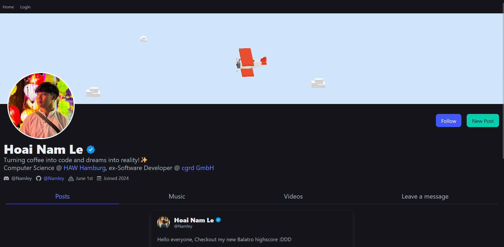
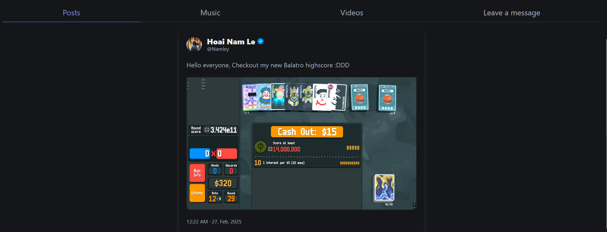

# Personal Portfolio & Microblog

A personal site and microblog built with Spring Boot, featuring OAuth authentication, tweet-like posts, and a simple
guest message system.

## 🚀 Features

- **Admin Panel**: Upload tweet-like blog posts with images.
- **Guest Messages**: Non-admin users can leave short messages.
- **OAuth Authentication**: Admin can log in using Google & GitHub.
- **Minimalist Design**: Styled with BulmaCSS.
- **In-Memory Database**: Uses H2 for lightweight storage.

## 🛠 Tech Stack

- **Backend**: Spring Boot (Thymeleaf, Spring Security, H2)
- **Frontend**: Thymeleaf + BulmaCSS
- **Authentication**: Google & GitHub OAuth

## 🔧 Setup & Installation

1. Clone the repository:
   ```sh
   git clone https://github.com/your-username/your-repo.git
   cd your-repo
2. Ensure you have Java 17+ installed.
    ```shell
   java -v
3. Install dependencies using Maven:
    ```sh
   mvn clean install
4. Run the application
    ```shell
   mvn spring-boot:run
5. Access the site at: http://localhost:8080

## 📌 Environment Variables

- Ensure you have the following environment variables set for OAuth login:
    ```sh
    spring.security.oauth2.client.registration.github.client-id=${CLIENT_ID_GITHUB}
    spring.security.oauth2.client.registration.github.client-secret=${CLIENT_SECRET_GITHUB}
    spring.security.oauth2.client.registration.google.client-id=${CLIENT_ID_GOOGLE}
    spring.security.oauth2.client.registration.google.client-secret=${CLIENT_SECRET_GOOGLE}spring.datasource.username=${DATASOURCE_USERNAME}
    spring.datasource.password=${DATASOURCE_PASSWORD}

## 📸 Screenshots


